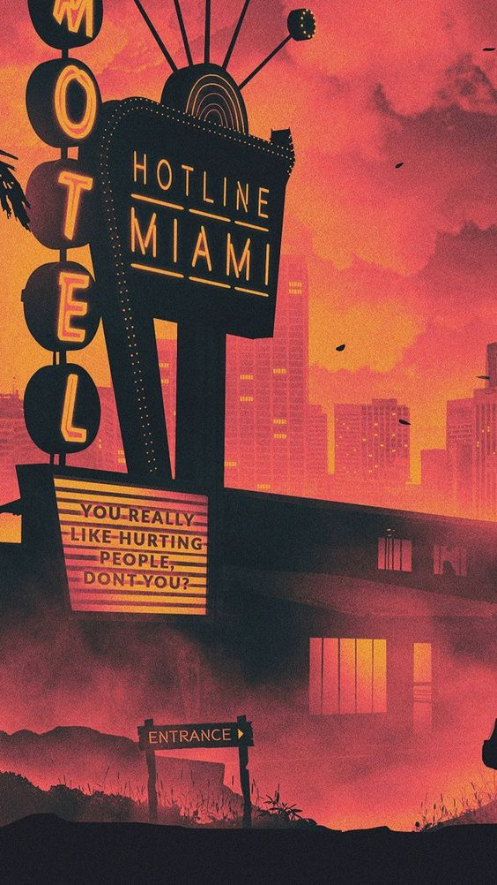

# The Arkham District

The Arkham district sits on the northernmost tip of Miami, right on the bleeding edge of the Hot Zone. There are a lot of ways to get chewed up and spit out that close to The Red. A lot of ways that a clever, tough, or lucky lancer could get paid, too.

## The Boroughs
- **Downtown** The centre of business, class, and polite society in Miami. Waving a gun around here is a really good way to attract some really bad attention from Miami's finest, who are more than happy to protect and serve the corpos who want their borough nice and friendly.
- **The Blocks** The megabuildings where 90% of Miami's housed residents live, each one its own ecosystem of businesses and gangs. The streets between buildings occasionally break out into open gunfights between rival blocks, to the peril of anyone trying to get home from work.
- **The Border** The heavily guarded border between Miami and devastated remains of the American continent. There are dangerous you can't imagine past this border, but there are also wonders that could set a lancer up for life.
- **The Ports** The shipyards are a mix of corporate shipping and receiving, criminal smugglers, and businesses looking to part sea-faring travellers from their hard earned bitz.
- **The Underground** The tunnels beneath Miami are a mix of subways, sewers, utility lines and homeless cities, all in various levels of maintenance and abandonment. I hope your tetanus shot is up-to-date.
- **The Yards** The industrial yards are the factories, laboratories, datacentres, and power plants where the blue-collar workers of the dystopian future make their living. Mutants and homeless make homes in the cracks between commercial properties, doing their best to avoid detection from the corporate thugs handling facility security.

## The Frontiers
- **The Cosmos** Mass drivers and reusable spacecraft have enabled the corps to exploit the heavens just as much as they've exploited the earth. Now enough bitz can get you a luxury condo on a cushy orbital satellite, or a vacation to N-Tech's lunar base. Just don't ask to go visit Mars.
- **The DataNet** The DataNet isn't just one internet, it's the catch all term for all of the internets. Old school websites, blocked-off corporate networks, and the full-matrix VRNet can all be beamed directly into the head of any lancer with a deck and death wish. Don't catch a virus. 
- **The_D%#a?>@$d&** **[REDACTED](../ComingSoon.md)**
- **Lim&n_* ^#$@r>?}</** **[REDACTED](../ComingSoon.md)**
- **The Ocean** Maritime law and  nautical transport are two of the few aspects of life that the corpos don't have a complete stranglehold over, leading to a marked rise in professional piracy among those with a more rebellious leaning. Hoist the sails, matey!
- **The Red** The Red is the ruins of old North America, torn up and tainted by a still not-quite-explained volcanic catastrophe from decades ago. Now smugglers make a living looting what they can and selling it back to the civilised world, assuming they survive the nomads, mutants, and whatever other lethal weirdness The Red can spit out.

 **[Main Menu](../README.md)**